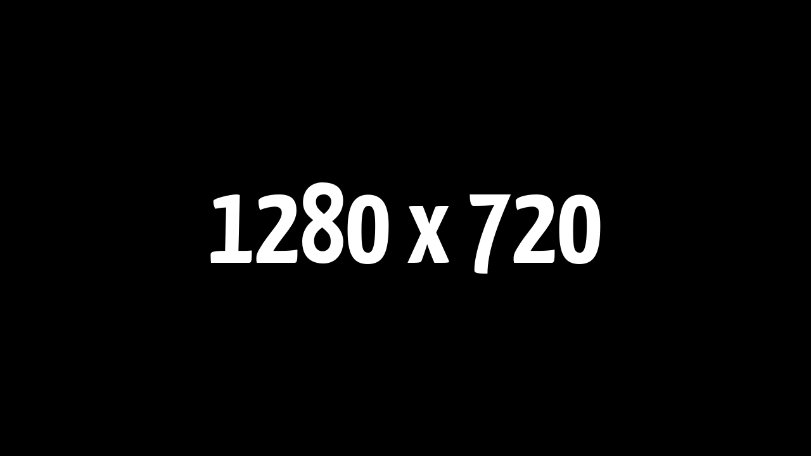

<hr><div>
<a href="../.."></a>
<h1>ubuhogen</h1>
<p>Configuration script for Ubuntu</p>
</div><hr>

## Preface

This is an opiniated post installation script for Ubuntu.
It was specially designed for my personal use, so don't execute it blindly.
I obviously encourage you to modify this script for your own use.

## Usages

### Download and run the script

```shell
curl https://raw.githubusercontent.com/sharpordie/ubuhogen/master/src/ubuhogen.sh | sh
```

## Gallery

<a href="assets/img1.png"></a><a></a><a href="assets/img2.png"></a><a href="assets/img3.png"></a><a></a><a href="assets/img4.png"></a>
